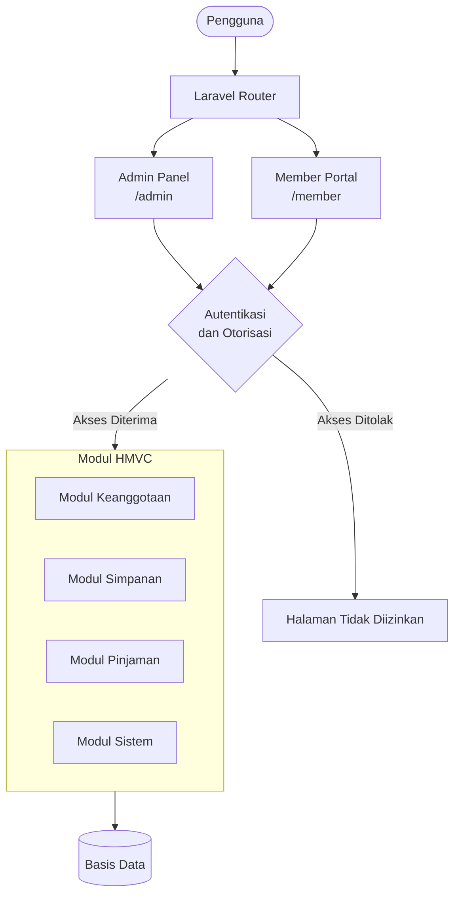

# KOSIPI — Sistem Informasi Koperasi Simpan Pinjam

Sistem informasi berbasis web yang dirancang untuk mendigitalisasi pengelolaan koperasi simpan pinjam agar lebih terstruktur, transparan, dan mudah dikelola oleh seluruh pemangku kepentingan.

## Tentang Proyek

Banyak koperasi simpan pinjam masih mengandalkan pencatatan manual yang rentan terhadap kesalahan, tidak transparan, dan sulit diaudit. KOSIPI hadir sebagai solusi digital yang memindahkan seluruh proses operasional koperasi ke dalam satu sistem terpusat — mulai dari pengelolaan keanggotaan, pencatatan simpanan, hingga penjadwalan angsuran pinjaman secara otomatis.

Sistem ini dibangun di atas kerangka kerja Laravel dengan arsitektur HMVC menggunakan paket `nwidart/laravel-modules`, sehingga setiap domain bisnis berdiri sebagai modul yang mandiri dan mudah dikembangkan secara independen. Antarmuka administrasi dikelola melalui Filament PHP yang menyediakan dua panel terpisah: satu untuk pengelola koperasi dan satu lagi untuk anggota.

## Fitur Utama

**Panel Administrasi**

Dapat diakses oleh pengelola (Super Admin, Ketua, Bendahara, dan Sekretaris) untuk mengelola seluruh aspek operasional koperasi:

- **Manajemen Pengguna**: Pengelolaan hak akses peran dan izin secara granular menggunakan Filament Shield berbasis Spatie Permission.
- **Data Master Sistem**: Konfigurasi parameter koperasi seperti daftar unit kerja, instansi terafiliasi, status kepegawaian, dan opsi agama.
- **Pengaturan Finansial**: Pengelolaan besaran bunga pinjaman, besaran denda keterlambatan, dan tenggat waktu pembayaran.

**Portal Anggota**

Portal mandiri bagi anggota koperasi untuk memantau aktivitas keuangan mereka secara langsung:

- **Dasbor Keuangan**: Visualisasi ringkasan simpanan, tagihan aktif, dan status transaksi terakhir.
- **Buku Transaksi**: Riwayat mutasi simpanan dan pembayaran angsuran pinjaman secara lengkap.
- **Manajemen Profil**: Pembaruan data pribadi anggota tanpa perlu menghubungi pengelola.

**Modul Keanggotaan**

Pengelolaan data anggota secara mendalam, termasuk pencatatan NBA, NIP, NIK, instansi asal, status pernikahan, ahli waris, dan tanggal bergabung. Terdapat pula sinkronisasi otomatis antara akun pengguna dengan entitas keanggotaan.

**Modul Simpanan**

- **Jenis Simpanan**: Mendukung pencatatan Simpanan Pokok, Simpanan Wajib, dan Simpanan Sukarela.
- **Penarikan Sukarela**: Anggota dapat mengajukan penarikan simpanan sukarela dengan validasi batas saldo maksimal secara langsung.
- **Rekonsiliasi Saldo**: Pencatatan total akumulasi simpanan anggota untuk pelaporan keuangan yang akurat.

**Modul Pinjaman**

- **Pengajuan Pinjaman**: Anggota dapat mengajukan pinjaman dengan nominal tertentu yang akan diverifikasi oleh pengelola.
- **Penjadwalan Tagihan Otomatis**: Pembuatan jadwal angsuran bulanan secara otomatis, termasuk perhitungan bunga dan kalkulasi denda jika melewati tenggat waktu.

## Alur Kerja dan Arsitektur

Sistem ini mengadopsi pola HMVC di mana setiap domain bisnis dipisahkan ke dalam modul tersendiri di bawah direktori `Modules/`. Permintaan dari browser diarahkan ke panel yang sesuai (Admin atau Member), lalu diproses oleh modul yang bertanggung jawab, sebelum akhirnya berinteraksi dengan basis data.



## Struktur Proyek

```
Kosipi-HMVC/
├── app/                        # Logika inti aplikasi Laravel
│   ├── Filament/               # Panel dan konfigurasi Filament
│   ├── Http/                   # Controller dan Middleware utama
│   ├── Models/                 # Model Eloquent inti
│   ├── Observers/              # Observer untuk event model
│   ├── Policies/               # Kebijakan otorisasi
│   ├── Providers/              # Service Provider
│   └── Support/                # Kelas pendukung dan helper
├── Modules/                    # Modul HMVC independen
│   ├── Keanggotaan/            # Domain data dan logika keanggotaan
│   ├── Simpanan/               # Domain transaksi simpanan
│   ├── Pinjaman/               # Domain pengajuan dan angsuran pinjaman
│   └── Sistem/                 # Konfigurasi parameter operasional
├── config/                     # Konfigurasi aplikasi
├── database/                   # Migrasi dan seeder
├── resources/                  # Aset frontend (views, CSS, JS)
├── routes/                     # Definisi rute aplikasi
└── .env.example                # Template konfigurasi environment
```

## Teknologi yang Digunakan

| Kategori | Teknologi |
|---|---|
| Backend | PHP 8.3, Laravel 13 |
| Admin Panel | Filament PHP 5 |
| Modularisasi | nwidart/laravel-modules 13 |
| Kontrol Akses | Filament Shield, Spatie Permission 7 |
| Frontend | Livewire, Tailwind CSS |
| Ekspor Data | Spatie Simple Excel |
| Basis Data | MySQL, PostgreSQL, atau SQLite |
| Build Tool | Vite, Node.js |

## Panduan Instalasi dan Penggunaan

### Prasyarat

Sebelum memulai, pastikan perangkat Anda telah terpasang:

- PHP versi 8.3 atau lebih tinggi
- Composer
- Node.js dan NPM
- Server basis data (MySQL, PostgreSQL, atau SQLite)

### Langkah 1: Klon Repositori

```bash
git clone https://github.com/fritzkmanurung/MATKUL_PSI_KOSIPI.git
cd MATKUL_PSI_KOSIPI
```

### Langkah 2: Instal Dependensi

Instal pustaka PHP melalui Composer dan pustaka JavaScript melalui NPM:

```bash
composer install
npm install
```

### Langkah 3: Konfigurasi Environment

Salin berkas contoh konfigurasi `.env.example` menjadi `.env` lalu buat kunci enkripsi aplikasi:

```bash
copy .env.example .env
php artisan key:generate
```

Sesuaikan konfigurasi basis data di dalam berkas `.env` yang baru dibuat. Jika menggunakan SQLite, cukup pastikan baris berikut aktif:

```env
DB_CONNECTION=sqlite
```

Kemudian buat berkas basis data kosong terlebih dahulu jika belum ada:

```bash
php -r "file_exists('database/database.sqlite') || touch('database/database.sqlite');"
```

### Langkah 4: Migrasi dan Isi Data Awal

Jalankan migrasi basis data untuk membuat tabel sistem, lalu jalankan seeder untuk mengisi data master awal dan akun demo:

```bash
php artisan migrate --seed
```

### Langkah 5: Jalankan Aplikasi

Gunakan perintah berikut untuk menjalankan seluruh layanan pengembangan sekaligus (server Laravel, queue, log, dan Vite) dalam satu terminal:

```bash
composer run dev
```

Aplikasi kini dapat diakses melalui browser di:

- Portal Utama: http://127.0.0.1:8000
- Admin Portal: http://127.0.0.1:8000/admin
- Member Portal: http://127.0.0.1:8000/member

## Kredensial Pengujian

Gunakan akun demo berikut yang telah dibuat secara otomatis oleh seeder untuk menguji berbagai peran di dalam sistem. Kata sandi untuk semua akun adalah `password`.

| Peran | Alamat Email | Deskripsi Akses |
|---|---|---|
| Super Admin | admin@kosipi.com | Akses penuh seluruh sistem dan manajemen hak akses |
| Ketua Koperasi | admin2@kosipi.com | Kelola data master dan keuangan tanpa manajemen otorisasi sistem |
| Bendahara | bendahara@kosipi.com | Kelola transaksi simpanan, penarikan, dan pinjaman |
| Sekretaris | pengawas@kosipi.com | Akses baca data keuangan dan kelola penuh data keanggotaan |
| Anggota | anggota@kosipi.com | Akses ke portal anggota untuk memantau tabungan dan pinjaman |

## Tim Pengembang

| Nama | Peran |
|---|---|
| Fritz Kevin Manurung | Project Lead |
| Dhino R. Turnip | Backend Developer |
| Marudut Tampubolon | Backend Developer |
| Griselda | Frontend Developer |
| Lasni Simanjuntak | Frontend Developer |

## Lisensi

Sistem ini dirilis di bawah lisensi MIT.
